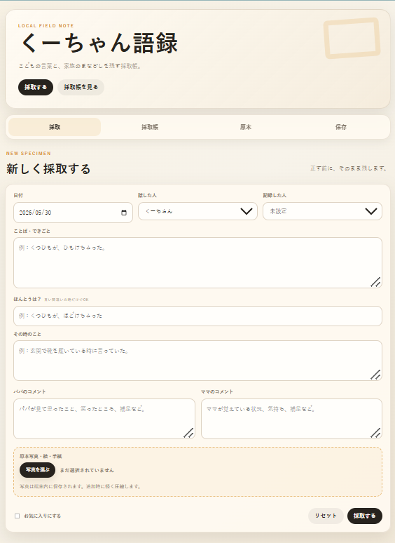

# 言い間違い採取帳

**言い間違い採取帳** は、子どもの言葉・言い間違い・語録・絵・手紙を、家族の記憶として残すための小さなPWAアプリです。

子どもの言葉は、すぐに正しくなってしまいます。
でも、正しくなる前の言葉には、その子だけの世界の見え方が残っています。

このアプリは、そんな一瞬の言葉を、写真やコメントと一緒に残すための採取帳です。

## Screenshot

<p align="center">
  
</p>

## Live Demo

https://iimachigai-saishucho.pages.dev

## Concept

これは、AIで分析する育児アプリではありません。
子どもの言葉を、親がそのまま採取するためのアプリです。

記録するのは、正しい言葉ではなく、今しか出てこない言葉です。

* 言い間違い
* こども語録
* 家族の会話
* 絵
* 手紙
* その時の空気
* パパのコメント
* ママのコメント

子どもの言葉と、それを見ていた家族のまなざしを残します。

## Features

* 子どもの名前を初回設定
* 1人なら「○○語録」
* 兄弟がいる場合は「○○＆○○語録」
* 話した人を子どもごとに選択
* 日付、言葉、ほんとうは？、その時のことを記録
* パパのコメント、ママのコメントを別々に保存
* 原本写真・絵・手紙を添付
* お気に入り登録
* 採取帳一覧表示
* 原本写真表示
* カード画像保存
* JSONバックアップ
* JSON復元
* PWA対応
* AIなし
* サーバー送信なし
* 端末内保存

## Privacy

このアプリは、入力されたデータを外部サーバーに送信しません。

記録した内容や写真は、ブラウザ内に保存されます。
バックアップが必要な場合は、JSONファイルとして書き出してください。

## Why No AI?

このアプリでは、あえてAIを使っていません。

子どもの言葉に、外部の解釈を加えないためです。
言葉そのもの、家族のコメント、その時の写真だけを静かに残します。

## How to Use

1. 最初に子どもの名前を入力します。
2. 兄弟がいる場合は、複数の名前を登録できます。
3. 「採取する」から新しい言葉を記録します。
4. 必要に応じて、原本写真・絵・手紙を添付します。
5. パパのコメント、ママのコメントを残します。
6. 採取帳から過去の言葉を見返します。
7. JSONでバックアップできます。

## Recommended Use

* 子どもの言い間違いを残す
* 家族だけの語録を作る
* ノートに書いた記録をデジタル化する
* 絵や手紙を一緒に保存する
* 将来、子どもに見せる記録として残す

## Deploy

Cloudflare Pages で公開できます。

```powershell
cd "$env:USERPROFILE\Desktop\iimachigai-saishucho"
npx wrangler pages deploy . --project-name iimachigai-saishucho
```

## Project Type

* Static Web App
* PWA
* Local-first app
* No AI
* No backend required

## Author

Created by MASATO NASU
https://masato-lab.pages.dev

## License

MIT License
